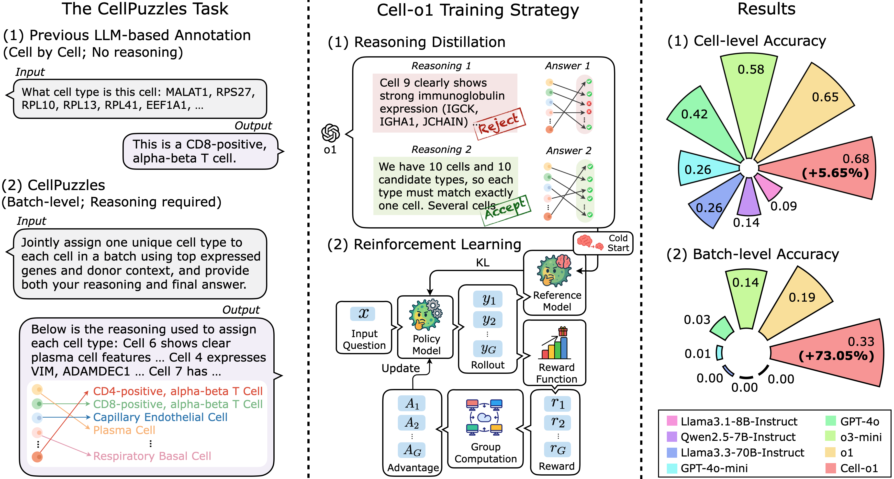

<h1 align="center">
  
  Cell-o1: Training LLMs to Solve Single-Cell Reasoning Puzzles with Reinforcement Learning
</h1>


<p align="center">
  <a href="https://www.arxiv.org/abs/2506.02911" target="_blank"></a>
  <a href="https://github.com/ncbi-nlp/cell-o1"></a>
  <a href="https://huggingface.co/datasets/ncbi/CellPuzzles"></a>
  <a href="https://huggingface.co/ncbi/Cell-o1"></a>
</p>

<be>


## 📑 Contents
- [📖 Overview](#1)
- [⚙️ Installation](#2)
- [⚡️ Quick Start](#3)
- [🚀 Full Training Pipeline](#4)
  - [📦 Step 1: Download Preprocessed Data](#4-1) 
  - [🧠 Step 2: Supervised Fine-Tuning (SFT)](#4-2)
  - [🎯 Step 3: Reinforcement Learning (GRPO / PPO)](#4-3)
    - [3.1  Preprocess Training Data](#5-1)
    - [3.2 Run GRPO Training](#5-2)
    - [3.3 Optional: Run PPO Instead](#5-3)
    - [3.4 Convert RL Checkpoint to Hugging Face Format](#5-4)
  - [🧪 Step 4: Run Inference on Test Set](#4-4)
  - [📊 Step 5: Evaluate Model Predictions](#4-5)
- [About](#5)
  - [📜 Disclaimer](#5-1)
  - [📚 References](#5-2)
  - [🫱🏻‍🫲 Acknowledgements](#5-3)


<h2 id="1">📖 Overview</h2>

Cell type annotation is a key task in analyzing the heterogeneity of single-cell RNA sequencing data. Although recent foundation models automate this process, they typically annotate cells independently, without considering batch-level cellular context or providing explanatory reasoning. In contrast, human experts often annotate distinct cell types for different cell clusters based on their domain knowledge. 
To mimic this expert behavior, we introduce ***CellPuzzles***—a benchmark requiring unique cell-type assignments across cell batches. Existing LLMs struggle with this task, with the best baseline (OpenAI's o1) achieving only 19.0% batch accuracy. To address this, we present ***Cell-o1***, a reasoning-enhanced language model trained via SFT on distilled expert traces, followed by RL with batch-level rewards. ***Cell-o1*** outperforms all baselines on both cell-level and batch-level metrics, and exhibits emergent behaviors such as self-reflection and curriculum reasoning, offering insights into its interpretability and generalization.

<br>

<p align="center">
  
</p>


<h2 id="2">⚙️ Installation</h2>

```
conda create -n cello1 python=3.9
conda activate cello1

# install torch [or you can skip this step and let vllm to install the correct version for you]
pip install torch==2.4.0 --index-url https://download.pytorch.org/whl/cu121
# install vllm
pip3 install vllm==0.6.3 # or you can install 0.5.4, 0.4.2 and 0.3.1
pip3 install ray
pip install transformers==4.47.0
pip install trl==0.17.0

# verl
cd src/verl
pip install -e .

# flash attention 2
pip3 install flash-attn --no-build-isolation
# quality of life
pip install wandb IPython matplotlib
```

<h2 id="3">⚡️ Quick Start</h2>


<h2 id="4">🚀 Full Training Pipeline</h2>
We provide preprocessed training and test data so you can get started immediately with model fine-tuning and reinforcement learning. 

<br>
<h3 id="4-1">📦 Step 1: Download Preprocessed Data</h3>

You can load the dataset using the 🤗 `datasets` library:

```python
from datasets import load_dataset
import json

# Load all splits
dataset = load_dataset("ncbi/CellPuzzles")

# Access each split
reasoning_data = dataset["reasoning"]   # For SFT
train_data = dataset["train"]           # For RL
test_data = dataset["test"]             # For evaluation

# Save each split to JSON
os.makedirs("processed_data", exist_ok=True)
with open("processed_data/sft_train.json", "w") as f:
    json.dump(reasoning_data, f, indent=2)
with open("processed_data/grpo_train.json", "w") as f:
    json.dump(train_data, f, indent=2)
with open("processed_data/test_data.json", "w") as f:
    json.dump(test_data, f, indent=2)
```

- `reasoning`: Expert-like reasoning traces distilled from o1, used to cold start the model via SFT.

- `train`: Raw QA-style data used for RL, containing both user prompts and gold answers.

- `test`: Held-out data for evaluation, formatted similarly to `train`.

<br>
<h3 id="4-2">🧠 Step 2: Supervised Fine-Tuning (SFT)</h3>

Use the `reasoning` split to cold start the model with expert-like reasoning traces.

```bash
cd sft
bash sft.sh
```

This will:
- Fine-tune the base model on `processed_data/sft_train.json` using LoRA adapters
- Merge LoRA weights back into the base model for downstream reinforcement learning

> 📌 Edit `DATA_PATH` in sft.sh if your file path differs from the default.

<br>
<h3 id="4-3">🎯 Step 3: Reinforcement Learning (GRPO / PPO)</h3>

Use the `train` split (`processed_data/grpo_train.json`) to train the model with batch-level rewards.

<h4 id="5-1">🧱 3.1  Preprocess Training Data </h4>
Convert the raw JSON data into Parquet format:

```bash
cd verl
python examples/data_preprocess/cello1.py \
    --train_file ../processed_data/grpo_train.json \
    --local_dir ./parquet_output
```

This creates `.parquet` files in `parquet_output/`, used for training and validation.

<h4 id="5-2">🏋️‍♂️ 3.2  Run GRPO Training </h4>

Launch GRPO reinforcement learning:

```bash
bash examples/grpo_trainer/run_cello1_grpo.sh
```

> 📌 Before running, edit the script to set:
> - `train_files` / `val_files`: your .parquet paths
> - `model.path`: path to the merged SFT checkpoint from Step 2

<h4 id="5-3">🔁 3.3 Optional: Run PPO Instead </h4>

To use PPO instead of GRPO:

```bash
bash examples/ppo_trainer/run_cello1_ppo.sh
```

<h4 id="5-4">📤 3.4 Convert RL Checkpoint to Hugging Face Format </h4>

After RL training, if your model is saved in FSDP (Fully Sharded Data Parallel) format, you can convert it to Hugging Face format using:

```bash
python scripts/convert_fsdp_to_hf.py \
  /path/to/fsdp_checkpoint/actor \
  /path/to/huggingface_template_model \
  /path/to/save/huggingface_model
```
- **First argument**: path to the FSDP actor checkpoint (e.g., `global_step_2500/actor`)
- **Second argument**: base model directory used to load config and tokenizer (e.g., `Qwen/Qwen2.5-7B-Instruct`)
- **Third argument**: output directory to save the converted Hugging Face model (e.g., `global_step_2500/huggingface`)

<br>
<h3 id="4-4">🧪 Step 4: Run Inference on Test Set</h3>

After converting your model to Hugging Face format, run inference using `scripts/test.py`.
This script supports multi-shard decoding via `--n` (total shards) and `--i` (shard index).

```bash
CUDA_VISIBLE_DEVICES=0 python scripts/test.py \
  --n 1 \
  --i 0 \
  --llm_name /path/to/global_step_2500/huggingface \
  --folder prediction_output \
  --dataset /path/to/test_data.json
```

- `--n`: Total number of shards (e.g., `1` for single process)
- `--i`: Shard index (0-based, must be < `n`)
- `--llm_name`: Path to the converted Hugging Face model (e.g., `global_step_2500/huggingface`)
- `--folder`: Output directory where predictions are saved (one JSON per example)
- `--dataset`: Path to the test set JSON file (e.g., `processed_data/test_data.json`)

> 📌 To run multi-shard decoding (e.g., 16 shards across 8 GPUs), you can launch multiple instances of this script with different `--i` and `CUDA_VISIBLE_DEVICES`.
> For example, to run 4 shards across 2 GPUs:
> ```bash
> # Example: Run 4 shards across 2 GPUs (2 processes per GPU)
> CUDA_VISIBLE_DEVICES=0 python scripts/test.py --n 4 --i 0 --llm_name path/to/model --folder prediction_output --dataset processed_data/test_data.json &
> CUDA_VISIBLE_DEVICES=0 python scripts/test.py --n 4 --i 1 --llm_name path/to/model --folder prediction_output --dataset processed_data/test_data.json &
> CUDA_VISIBLE_DEVICES=1 python scripts/test.py --n 4 --i 2 --llm_name path/to/model --folder prediction_output --dataset processed_data/test_data.json &
> CUDA_VISIBLE_DEVICES=1 python scripts/test.py --n 4 --i 3 --llm_name path/to/model --folder prediction_output --dataset processed_data/test_data.json &
> wait
> ```

<br>
<h3 id="4-5">📊 Step 5: Evaluate Model Predictions</h3>

To run the evaluation:

```bash
python eval.py --input_dir prediction_output/
```
Where `prediction_output/` contains the JSON prediction files generated in Step 4. 

It reports:
- **Partial Accuracy (cell-level)**: proportion of correctly matched cell types per batch.
- **Exact Match Accuracy (batch-level)**: proportion of batches with fully correct cell-type assignments.
- **Legitimate Format Ratio**: how often the prediction strictly follows the `<think>...</think>\n<answer>...</answer>` format.
- **Uniqueness Score**: diversity of predicted types (higher is better).
- **Prediction Length**: average number of tokens in each prediction.


---

<h2 id="5">About</h2>

<h2 id="5-1"> 📜 Disclaimer</h2>


<h2 id="5-2"> 📚 References</h2>
If you use our repository, please cite the following related paper:

```
@article{fang2025cello1,
  title={Cell-o1: Training LLMs to Solve Single-Cell Reasoning Puzzles with Reinforcement Learning},
  author={Fang, Yin and Jin, Qiao and Xiong, Guangzhi and Jin, Bowen and Zhong, Xianrui and Ouyang, Siru and Zhang, Aidong and Han, Jiawei and Lu, Zhiyong},
  journal={arXiv preprint arXiv:2506.02911},
  year={2025}
}
```

<h2 id="5-3"> 🫱🏻‍🫲 Acknowledgements</h2>

We appreciate [verl](https://github.com/volcengine/verl), [TinyZero](https://github.com/Jiayi-Pan/TinyZero), [Search-R1](https://github.com/PeterGriffinJin/Search-R1), [ReCall](https://github.com/Agent-RL/ReCall), and many other related works for their open-source contributions. The logo of the model is automatically generated by [GPT-4o](https://openai.com/index/hello-gpt-4o/).

